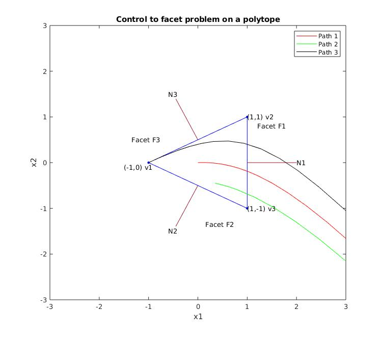

# control-to-facet
Piecewise affine control to facet feedback controller

This source code implements a control-to-facet controller on a polytope. 

## Problem statement: 
Given an affine system $\dot{x} = Ax + Bu + c$ on a full dimensional polytope $P$ with a certain facet $F_{i}$, find a feedback control law $u = f(x)$ such that for any initial state $x(0) \in P$, there is a finite time $T$, where the system $x(T)$ reaches or exits the facet $F_{i}$.
For the theory and the math, please refer the literature in the `doc/literature`.

## Solution:
The problem is worked out [here](doc/solution/control2facet_solution.pdf) and the source code is available [here](src/control2facet.m).

## Results:
The visual representation of the polytope facets (including normals) and the trajectory exiting the desired facet can be seen in the picture.

## Steps to run:
1. Open `control2facet.m`.
2. Set the vertices of the polytopes (triangle in this example).
3. Set the normal vectors to the facets.
4. Run `control2facet.m`.
